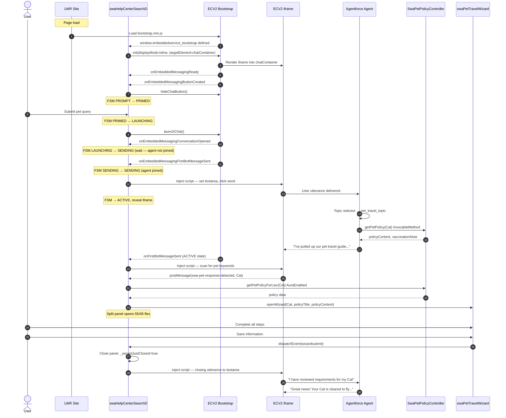

# Southwest Airlines Help Center — Agentforce Architecture Guide

**Prepared by:** Dave Harding, FDE / AXS  
**Project:** Southwest Airlines Help Center — Concept D  
**Stack:** Salesforce Experience Cloud LWR · ECV2 Inline Mode · Agentforce · LWC

---

## Overview

This document explains the end-to-end architecture of the Southwest Airlines Help Center Experience Cloud site, with focus on Concept D — the production-grade pattern that embeds a fully branded Agentforce conversational AI experience inline in a custom LWC wrapper. It is written for architects who need to understand data flow, trigger points, security boundaries, and the reasoning behind each technical decision — including the workarounds required to make the platform behave.

The pet travel wizard is the flagship feature: a contextual LWC panel that opens alongside the chat when the agent detects a pet travel topic, collects structured data from the user, and feeds the results back into the conversation as a verified confirmation.

---

## The Three Problems This Architecture Solves

### 1. Platform UI vs. Brand UI Tension
ECV2 (Embedded Conversation V2) ships with its own header, floating widget behavior, and platform-controlled branding. Southwest's requirements demand a fully custom experience — Southwest color palette, diagonal band gradient header, search-to-chat transition, and no visible platform chrome.

The platform provides no supported way to restyle ECV2 internals from outside. Everything visible to the customer must come from the LWC wrapper, not from ECV2.

### 2. Lightning Web Security (LWS) vs. Runtime Control
LWC code runs inside the LWS sandbox — a security boundary that blocks:
- Direct calls to `window.embeddedservice_bootstrap.init()` (if Head Markup already called it)
- Shadow root traversal on elements outside the LWC's own tree
- DOM manipulation of ECV2 iframe contents from LWC code

Every "obvious" approach to customizing ECV2 from within a LWC fails here silently.

### 3. Utterance Injection Timing
ECV2's bootstrap fires events in a precise sequence. Sending a message too early — at `onEmbeddedMessagingConversationOpened` — delivers it before the Atlas Reasoning Engine agent has joined the session. The message appears in the chat with no response. The correct trigger is `onEmbeddedMessagingFirstBotMessageSent`, which fires only after the agent sends its welcome message, confirming it is joined and ready.

---

## Layer 1: Experience Cloud LWR Site

### What It Is
A Lightning Web Runtime (LWR) site — Salesforce's React-like, server-rendered framework for Experience Cloud. All components are Lightning Web Components deployed via SFDX metadata.

### Why LWR
LWR has no Shadow DOM enforcement across components, which means global CSS overrides work at the page level. This is both a problem and a solution: the `*` CSS reset that SLDS requires can be applied globally, but it also collapses every element on the page to `height: 0`.

### The CSS Cascade Problem
Every LWC uses `* { margin: 0 !important; padding: 0 !important }` to override SLDS defaults. In LWR, this `*` selector applies to the entire page — including the ECV2 `.embedded-messaging` container — collapsing it to zero height and making the chat widget invisible.

**Fix:** A global static resource (`swaHelpCenterOverrides.css`) loaded via `loadStyle()` in an invisible utility LWC (`swaGlobalStyles`) placed on every page. This stylesheet applies higher-specificity counter-rules that restore the ECV2 container dimensions:

```css
.embedded-messaging {
    position: fixed !important;
    bottom: 0 !important;
    right: 0 !important;
    width: auto !important;
    height: auto !important;
}
```

**Why not `<link>` in Head Markup:** LWR's CDN does not resolve static resource URLs in `<link>` tags in Head Markup. The only reliable global CSS injection is `loadStyle()` from a LWC component on the page.

### Head Markup Role
Head Markup contains only:
1. SLDS stylesheet links (`salesforce-lightning-design-system-part1–4.css`, DXP hooks)
2. The ECV2 `bootstrap.min.js` script loader — **with no `init()` call**

The `init()` call was deliberately removed from Head Markup. If Head Markup calls `init()` first with default settings, `displayMode` defaults to floating and `targetElement` is `body`. Any subsequent call from the LWC is ignored. The LWC must own the full initialization.

> **Republish required:** Head Markup changes require Experience Builder republish. LWC JS/CSS/HTML changes do not.

---

## Layer 2: The LWC Wrapper (`swaHelpCenterSearchD`)

This is the architectural core of the experience. It owns:

- The branded search screen (pre-chat state)
- The branded chat header with Southwest diagonal band gradient
- The ECV2 inline container (`refs.chatContainer`)
- The FSM that orchestrates all state transitions
- The split-panel that hosts the pet travel wizard
- The postMessage bridge to/from the ECV2 iframe

### The Finite State Machine

ECV2's bootstrap fires events asynchronously and out-of-order depending on session state, SDO org latency, and whether a prior session exists. Without a formal FSM, race conditions cause silent failures. The FSM (adapted from Salesforce's open-source [help-agent-accelerator](https://github.com/salesforce/help-agent-accelerator)) makes every valid transition explicit and every invalid one a no-op.

```
States:   PROMPT → PRIMED → LOADING → LAUNCHING → SENDING → ACTIVE → ERROR
                                                                ↑
                                                          RETRY ┘
```

| State | Meaning |
|-------|---------|
| `PROMPT` | Search screen visible, bootstrap may not be ready |
| `PRIMED` | Bootstrap ready (`launchChat` available), awaiting user submit |
| `LOADING` | User submitted, waiting for bootstrap if not yet ready |
| `LAUNCHING` | `launchChat()` called, waiting for conversation to open |
| `SENDING` | Conversation open, agent joining, utterance queued |
| `ACTIVE` | Agent joined, chat fully operational |
| `ERROR` | Init or timeout failure |

**Why this matters for architects:** State transitions are the only place side effects occur. `_dispatch(event)` looks up `TRANSITIONS[currentState][event]` and calls `_onTransition()`. If a transition isn't in the table it is silently ignored. This prevents, for example, a stale `swa-msg-sent` postMessage from a prior session's injected script from clearing `_pendingQuery` at the wrong time.

### The `refs.chatContainer` Constraint

`bootstrap.init()` requires a live DOM element for `targetElement`. This means the ECV2 container div must exist in the DOM when `connectedCallback` runs.

**The constraint:** `lwc:if` removes elements from the DOM. If the chat layer is conditionally rendered and the user hasn't opened chat yet, `refs.chatContainer` is null when `init()` runs. The result: `displayMode` falls back to floating, and the FAB appears bottom-right.

**The fix:** Both the search layer (`.swa-prompt-layer`) and the chat layer (`.swa-chat-layer`) are always in the DOM. CSS `display: none/flex` handles visibility — never `lwc:if` on the container element.

### `displayMode: 'inline'` — Why It Changes Everything

The default ECV2 mode is floating: a FAB button bottom-right, clicking it opens a modal overlay. `displayMode: 'inline'` tells ECV2 to render its iframe directly into `targetElement` instead of into the page body. This is the only supported way to embed ECV2 inside a custom LWC layout.

With inline mode:
- No FAB — `hideChatButton()` suppresses the button that ECV2 still creates
- ECV2 renders its full UI inside `refs.chatContainer`
- The LWC controls sizing via CSS on the container
- The split panel (55% chat / 45% wizard) is a flex layout on the LWC side

### The Split Panel

When a pet topic is detected, the LWC adds the `swa-chat-split` class to `.swa-chat-body`:

```css
.swa-chat-pane     { flex: 1; transition: flex 0.3s linear; }
.swa-chat-split .swa-chat-pane { flex: 0 0 55%; }
.swa-wizard-pane   { flex: 0 0 45%; animation: swa-slide-in 0.3s linear; }
```

`linear` easing was deliberately chosen over `cubic-bezier` to avoid the bounce artifact that appears during the flex transition.

---

## Layer 3: ECV2 Bootstrap and the LWS Security Boundary

### The Boundary

Everything outside the ECV2 iframe is in LWC territory (subject to LWS). Everything inside the iframe is platform territory. LWS prevents direct cross-boundary access.

### What Works Across the Boundary (LWC → Bootstrap)

| API | Works from LWC? | Notes |
|-----|----------------|-------|
| `bootstrap.utilAPI.launchChat()` | ✅ Yes | Promise-based |
| `bootstrap.utilAPI.endChat()` | Partial | Not implemented on all orgs |
| `bootstrap.utilAPI.sendTextMessage()` | ✅ Production | `undefined` on SDO demo orgs |
| `bootstrap.utilAPI.hideChatButton()` | ✅ Yes | |
| `bootstrap.init()` | ✅ Yes (if Head Markup has no init) | |
| `bootstrap.settings.*` | ✅ Yes (set before init) | |
| `window.addEventListener(bootstrap events)` | ✅ Yes | |

### Bootstrap Event Sequence and Critical Timing

```
bootstrap.init() called
    ↓
onEmbeddedMessagingReady           → FAB created, settings accepted
onEmbeddedMessagingButtonCreated   → FSM: PRIMED, hideChatButton() called

launchChat() called
    ↓
onEmbeddedMessagingConversationOpened    ← ⚠️ DO NOT send utterance here
                                            Agent has NOT joined yet
    ↓
onEmbeddedMessagingFirstBotMessageSent  ← ✅ SAFE to send utterance
                                            Agent joined, welcome message sent
    ↓
sendTextMessage(userQuery)
```

**Why the timing matters:** Sending at `CONV_OPENED` results in the user's message appearing in the chat with no agent response — the session channel is open but the Atlas Reasoning Engine agent hasn't been allocated to it yet. `FirstBotMessageSent` is the confirmed signal that the agent has joined.

**The pre-warm trap:** Calling `launchChat()` before the user submits (to speed up the experience) causes `onEmbeddedMessagingFirstBotMessageSent` to fire in the background. This event fires only once per session. When the user then submits, `BOT_MESSAGE` is never dispatched again — utterance injection silently fails.

### The Script Injection Pattern (LWS Workaround)

ECV2's iframe is same-origin (served from `.my.site.com`). This means `iframe.contentDocument` is accessible from LWC code. The workaround: create a `<script>` element and append it to `iframeDoc.head`. This script executes natively in the iframe's own JavaScript context — completely outside LWS.

```javascript
const script = iframeDoc.createElement('script');
script.textContent = `(function() {
    // This runs OUTSIDE LWS — can access shadow roots, set values, click buttons
    function dq(root, sel) { /* deep query through shadow DOM */ }
    var ta = dq(document, 'textarea');
    var setter = Object.getOwnPropertyDescriptor(HTMLTextAreaElement.prototype, 'value').set;
    setter.call(ta, message);
    ta.dispatchEvent(new Event('input', { bubbles: true }));
    // ... poll for send button, click it
})();`;
iframeDoc.head.appendChild(script);
```

This pattern is used for:
1. **Utterance injection** — setting textarea value and clicking send
2. **ECV2 header hiding** — injecting CSS into every shadow root to hide `cwcmessaging-cwc-header-block`
3. **Pet keyword detection** — scanning agent response text after `BOT_MESSAGE`

### The SDO Utterance Injection Workaround

On SDO demo orgs, `utilAPI.sendTextMessage` is `undefined` due to the broken `EvfSdkController.getEventTypes` RPC call (visible as `lwr_bootstrap:3` error in console). This is an org infrastructure issue — not fixable in code.

**Fallback:** The script injection pattern finds the ECV2 `textarea` element through shadow DOM traversal, sets its value using the native prototype setter (bypassing React's synthetic event system), and polls for the send button to appear:

```javascript
var setter = Object.getOwnPropertyDescriptor(HTMLTextAreaElement.prototype, 'value').set;
setter.call(ta, message);
ta.dispatchEvent(new Event('input', { bubbles: true, composed: true }));
// Poll for send button (renders only after textarea has content)
var poll = setInterval(function() {
    var btn = findSendBtn(document);
    if (btn) { clearInterval(poll); btn.click(); }
}, 300);
```

### The postMessage Bridge

The only bidirectional communication channel between the LWC and the ECV2 iframe's injected scripts is `window.parent.postMessage`. The LWC listens on `window.addEventListener('message')` and dispatches actions based on message type.

**Message types:**

| Message | Direction | Purpose |
|---------|-----------|---------|
| `swa-msg-sent` | iframe → LWC | Utterance was sent; dispatch `MSG_SENT` to FSM |
| `swa-pet-response-detected` | iframe → LWC | Agent responded with pet keywords; open wizard |
| `swa-pet-wizard-trigger` | iframe → LWC | User clicked chip; reopen wizard |
| `swa-menu-items` | iframe → LWC | ECV2 menu items collected; open custom dropdown |

**Session ID guard:** `swa-msg-sent` messages include a timestamp-based session ID. The LWC only processes messages where `event.data.sessionId === this._sendSessionId`. This prevents stale scripts from prior sessions (still resident in the iframe DOM) from triggering `MSG_SENT` for the current session.

---

## Layer 4: Agentforce Agent

### Structure

The agent is defined in Agent Script DSL (`.agent` file) with:
- A `topic_selector` that routes based on user intent
- 7 topic handlers (booking, check-in, changes, baggage, Rapid Rewards, disruptions, general)
- 1 specialized topic: `pet_travel_topic`
- Apex `@InvocableMethod` actions for Knowledge search and pet policy

### Pet Travel Topic — Data Flow

```
User utterance → Topic Selector → pet_travel_topic
    ↓
show_pet_wizard action called
    ↓
SwaPetPolicyController.getPetPolicy(petType)  ← @InvocableMethod
    ↓
Returns: petType, policyTitle, policyContent, vaccinationNote
    ↓
Agent responds: "I've pulled up our pet travel guide..."
    ↓
LWC detects pet keywords in agent response (script injection)
    ↓
postMessage(swa-pet-response-detected, petType)
    ↓
LWC calls SwaPetPolicyController.getPetPolicyForLwc(petType)  ← @AuraEnabled
    ↓
Split panel opens with swaPetTravelWizard LWC
```

### Why Two Apex Methods?

`SwaPetPolicyController` has both `@InvocableMethod` (for the agent action) and `@AuraEnabled` (for the LWC direct call). This is because:

1. **CLT cards do not render in ECV2 inline iframe** on Experience Cloud. The agent's `@InvocableMethod` returns CLT-typed output, but the iframe only shows text. The LWC cannot read the CLT output.
2. **The LWC detects the topic independently** by scanning the agent's text response for pet keywords, then calls `@AuraEnabled` directly to get policy data.

Both methods call the same `buildResult()` private method — no duplicated business logic.

**Guest user access:** Both Apex methods use `without sharing`. Guest users on Experience Cloud have no sharing rules for custom objects. `with sharing` causes SOQL to return zero results silently. The class is marked `without sharing` because the data it returns is intentionally public content.

### Closing the Loop — Pet Verification Response

When the user closes the wizard (Save information), the LWC injects a closing utterance into the ECV2 textarea: "I have reviewed the pet travel requirements for my [pet type]." The agent's `pet_travel_topic` instructions are updated to respond to this specific utterance with a detailed, pet-specific travel confirmation including:
- Carrier requirements
- Weight limits
- Health certificate timing
- Fee
- Restrictions (domestic only, no Hawaii)

This creates a complete conversational arc: query → wizard → confirmation — all within the native ECV2 conversation thread.

---

## Layer 5: Pet Travel Wizard (`swaPetTravelWizard`)

### Architecture Decision — LWC Panel, Not Iframe Card

The wizard renders in the LWC's own DOM, not inside the ECV2 iframe. This was a deliberate choice because:

- LWC panels get full framework capabilities: `@track` state, `dispatchEvent`, file upload, lifecycle hooks
- The ECV2 iframe is a sealed platform UI — no supported way to embed a custom LWC inside it
- CLT (Custom Lightning Type) cards theoretically enable custom LWC renderers inside the chat, but this does not work in the ECV2 inline iframe on Experience Cloud (platform limitation on SDO orgs; confirmed broken by `EvfSdkController` RPC failure)

### Wizard Steps

**Step 1 — Pet Type Selection**
Four pet cards (Cat, Dog, Rabbit, Other). On selection, input fields appear below:
- If "Other": custom pet type text field
- Pet name (text)
- Pet weight in lbs (number)
- Confirm button → Step 2

**Step 2 — Vaccination Records**
- Drag-and-drop or click-to-upload file zone (PDF/JPG/PNG, 10MB max)
- File list with remove buttons
- Vaccination note (from Apex)
- Back / Continue buttons

**Step 3 — Summary**
- Pet emoji at top
- Summary table: pet type, name, weight, document count
- Back / Save information buttons
- Save fires `wizardsubmit` custom event → parent closes panel, injects closing utterance

### Why No X Button
The X button was removed from the wizard panel. "Save information" on step 3 is the only close trigger. This was a UX decision: forcing completion of step 3 ensures the closing utterance fires and the agent provides the verification response. An X mid-wizard would close silently without the conversation loop completing.

---

## Sequence Diagram



---

## Architectural Decision Summary

| Decision | Rationale | Workaround Required |
|----------|-----------|-------------------|
| `displayMode: 'inline'` | Embed ECV2 inside branded LWC container | `bootstrap.init()` must be in LWC, not Head Markup; Head Markup republish required |
| Always-in-DOM chat layer | `refs.chatContainer` must exist when `init()` runs | CSS `display:none/flex` instead of `lwc:if` |
| FSM with transition table | Async bootstrap events cause race conditions | 7 states, transition table makes invalid events no-ops |
| Script injection into iframe | LWS blocks shadow DOM access from LWC code | Same-origin iframe allows `contentDocument`; injected scripts run outside LWS |
| Textarea injection for utterance | SDO: `utilAPI.sendTextMessage` is `undefined` | Native prototype setter, shadow DOM traversal, send button polling |
| `onFirstBotMessageSent` timing | `CONV_OPENED` fires before agent joins | BOT_MESSAGE is the only safe send trigger |
| Session ID on `swa-msg-sent` | Stale injected scripts from prior sessions | Timestamp token matched in parent listener |
| postMessage bridge | Only bidirectional channel across LWS/iframe boundary | Typed messages with `STATE.ACTIVE` guard and `_wizardJustClosed` flag |
| Dual Apex methods (`@InvocableMethod` + `@AuraEnabled`) | CLT cards don't render in ECV2 iframe on Experience Cloud | LWC calls `@AuraEnabled` directly; agent calls `@InvocableMethod` |
| `without sharing` Apex | Guest users have no sharing rules; `with sharing` returns zero rows | Verified safe for public content only |
| Wizard in LWC DOM, not iframe | No supported way to embed custom LWC inside ECV2 iframe | Split panel flex layout in LWC; `dispatchEvent` for close signal |
| No X button on wizard | Force step 3 completion to trigger closing utterance + agent verification | "Save information" is the only close trigger |

---

## What This Enables for Future Builds

1. **Any contextual wizard** — the split panel pattern is reusable. Any agent topic can trigger a data-collection panel alongside the chat by adding: (a) a `BOT_MESSAGE` keyword detector, (b) an `@AuraEnabled` Apex method, and (c) a LWC panel component.

2. **Custom agent UI without Flows** — the postMessage bridge + script injection creates a general-purpose channel between the LWC and the ECV2 conversation. Any LWC behavior can be triggered by agent responses without requiring platform-level CLT rendering.

3. **Production readiness** — on a production org where `utilAPI.sendTextMessage` works, the textarea injection fallback is never used. The same codebase works on both SDO demos and production.

4. **Reference implementation** — the `swaHelpCenterSearchD` LWC with its FSM, postMessage bridge, and inline mode pattern is directly reusable for any Agentforce-on-Experience-Cloud deployment requiring a custom branded experience.
